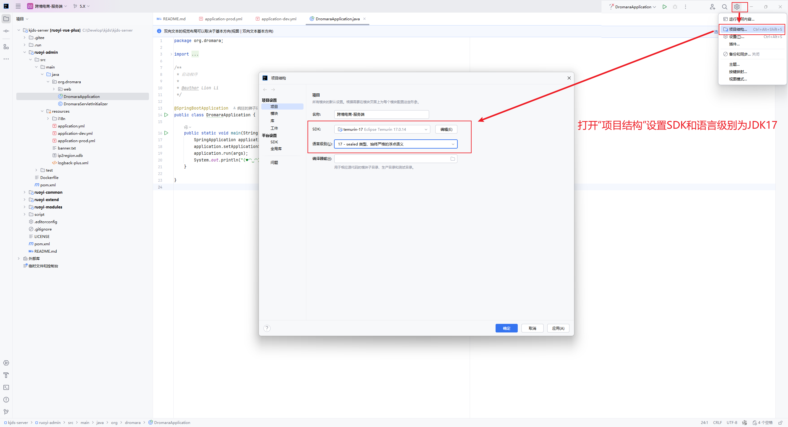
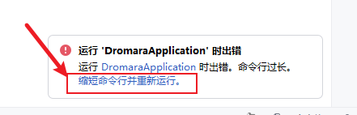
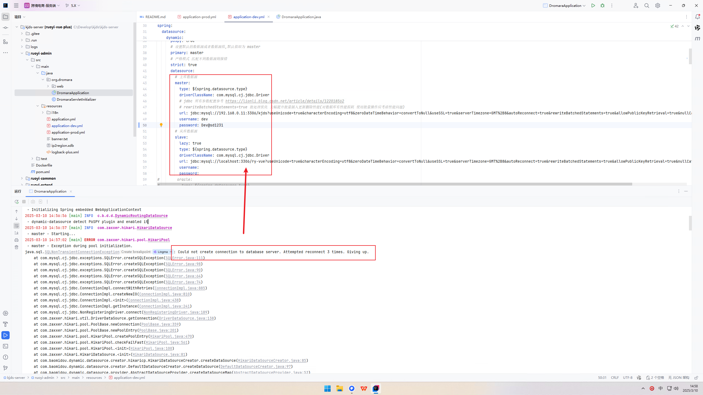
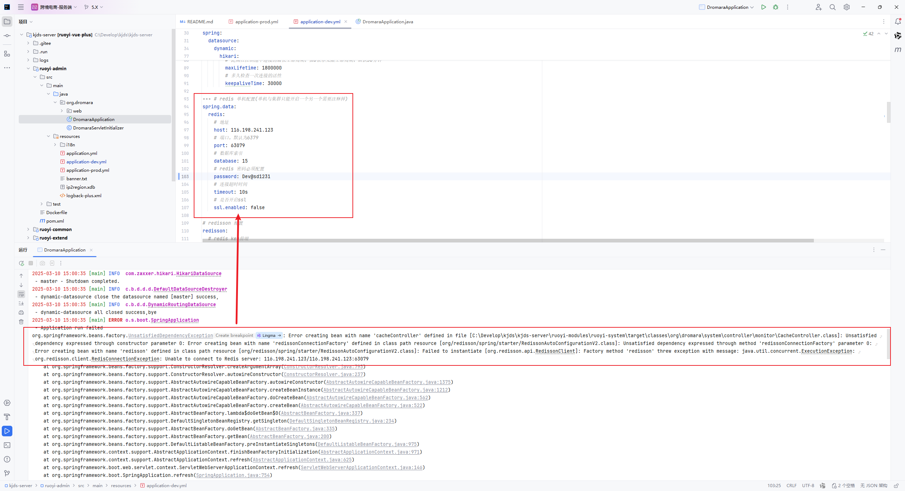
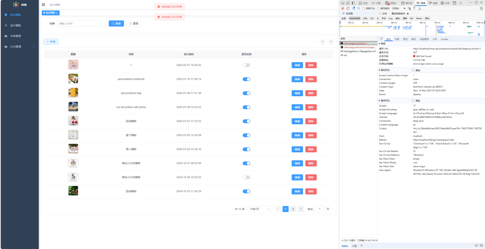
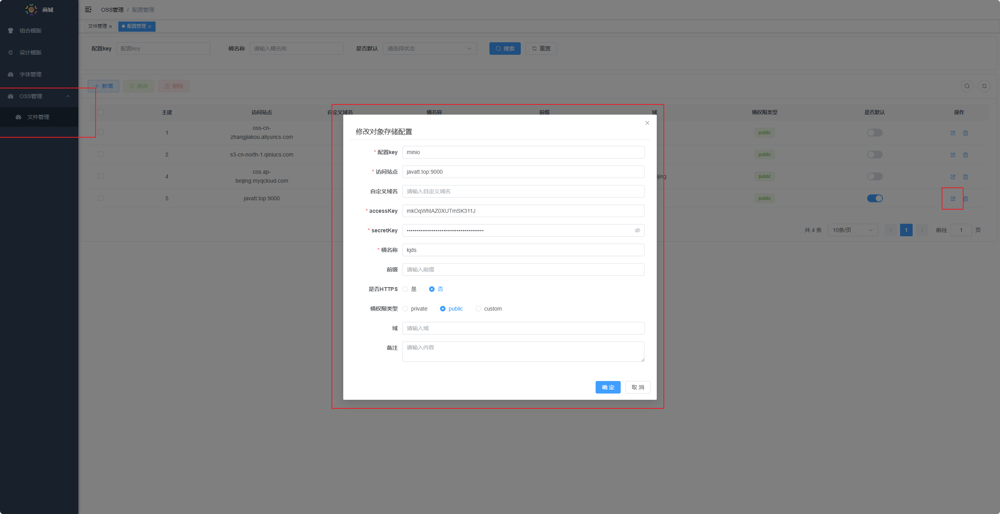
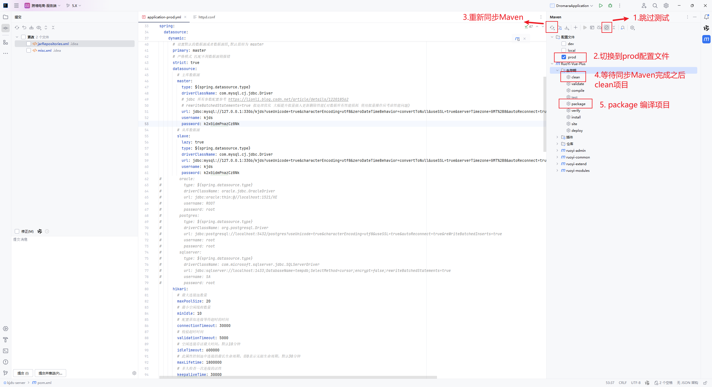

### 系统运行与部署详细教程

------

## **1. 环境准备**

在运行和部署 kjds-server 之前，需要安装以下必备软件：

| 软件        | 版本要求           | 说明                     |
| ----------- | ------------------ | :----------------------- |
| **JDK**     | 17 及以上          | 用于运行 Java 后端       |
| **MySQL**   | 5.7 及以上         | 数据库存储               |
| **Minio**   | --                 | 本地文件存储             |
| **Redis**   | 6.0 及以上         | 用于缓存加速             |
| **Maven**   | 3.8 及以上         | 用于管理后端依赖         |
| **Node.js** | 18.18 及以上       | 用于前端项目构建         |
| **Npm**     | 8 及以上           | 用于前端项目构建         |
| **Git**     | 最新版本           | 用于克隆代码             |
| **IDE**     | IDEA（2024.3推荐） | 用于开发和运行 Java 项目 |

### **1.1 下载并安装 JDK**

- 访问 [Oracle JDK 下载地址](https://www.oracle.com/java/technologies/downloads/#java17-windows) 并安装
- 配置环境变量：
  - `JAVA_HOME` 指向 JDK 安装目录
  - `PATH` 添加 `%JAVA_HOME%\bin`
  - `CLASSPATH` 设置为 `.;%JAVA_HOME%\lib`
- **验证安装**：打开终端输入 `java -version`，显示 Java 版本即成功

### **1.2 下载并安装 MySQL**

- 访问 [MySQL 官网](https://dev.mysql.com/downloads/) 下载 MySQL 并安装

- 进入 MySQL 命令行创建数据库：

  ```sql
  CREATE DATABASE kjds DEFAULT CHARACTER SET utf8mb4 COLLATE utf8mb4_general_ci;
  ```

- 记录 MySQL **用户名和密码**，后续需要填写到配置文件中

### **1.3 下载并安装 Redis**

- 访问 [Redis 官网](https://redis.io/) 下载并安装
- 启动 Redis 服务，运行 `redis-server`

### **1.4 下载并安装 Maven**

- 访问 [Maven 官网](https://maven.apache.org/download.cgi) 下载并解压
- 配置环境变量 `MAVEN_HOME`，将 `bin` 目录添加到 `PATH`
- **验证安装**：运行 `mvn -v` 确保 Maven 安装正确

### **1.5 下载并安装 Node.js**

- 访问 [Node.js 官网](https://nodejs.org/) 下载并安装
- **验证安装**：运行 `node -v` 和 `npm -v` 确保安装成功

------

## **2. 下载 kjds-server 代码**

代码下载完成后，进入项目目录：

```sh
cd kjds-server
```

------

## **3. 运行后端**

### **3.1 导入项目**

- 打开 IDEA，选择 **"打开"**，然后选择 `kjds-server` 目录
- 确保使用 **Maven** 构建，并等待依赖加载完成

### **3.2 配置数据库**

- 导入数据库：

  ```sql
  kjds_2025-02-18_15-43-56_mysql_data_7wkDE.sql.zip
  ```
- 修改 

  ```
  src/main/resources/application-dev.yml
  ```

   Mysql配置文件：

  ```yaml
    datasource:
      # 主库数据源
      master:
        type: ${spring.datasource.type}
        driverClassName: com.mysql.cj.jdbc.Driver
        url: jdbc:mysql://<你的数据库连接>:3306/kjds?useUnicode=true&characterEncoding=utf8&zeroDateTimeBehavior=convertToNull&useSSL=true&serverTimezone=GMT%2B8&autoReconnect=true&rewriteBatchedStatements=true&allowPublicKeyRetrieval=true&nullCatalogMeansCurrent=true
        username: <你的数据库账号>
        password: <你的数据库密码>
      # 从库数据源
      slave:
        lazy: true
        type: ${spring.datasource.type}
        driverClassName: com.mysql.cj.jdbc.Driver
        url: jdbc:mysql://<你的数据库连接>:3306/kjds?useUnicode=true&characterEncoding=utf8&zeroDateTimeBehavior=convertToNull&useSSL=true&serverTimezone=GMT%2B8&autoReconnect=true&rewriteBatchedStatements=true&allowPublicKeyRetrieval=true&nullCatalogMeansCurrent=true
        username: <你的数据库账号>
        password: <你的数据库密码>
  ```
  
  Redis配置文件：
  
  ```yaml
  --- # redis 单机配置(单机与集群只能开启一个另一个需要注释掉)
  spring.data:
    redis:
      # 地址
      host: <你的Redis连接>
      # 端口，默认为6379
      port: 6379
      # 数据库索引
      database: 0
      # redis 密码必须配置
      password: <你的Redis密码>
      # 连接超时时间
      timeout: 10s
      # 是否开启ssl
      ssl.enabled: false
  ```

### **3.3 配置IDEA**

配置JDK17




### **3.4 运行后端**

- 找到 `DromaraApplication.java`
- 右键选择 **"运行 'DromaraApplication'"**，启动后端

#### 可能遇到的出错的地方

- 1）命令行过长？

  解决方案：点击缩短命令行并重新运行

  

- 2）Could not create connection to database server. Attempted reconnect 3 times. Giving up.

  解决方案：检查数据库是否配置正确

  

- 3）Error creating bean with name 'cacheController' defined in file

  解决方案：检查Redis是否配置正确

  

**成功标志**：

- 终端显示 **"RuoYi-Vue-Plus启动成功"**
- 后端 API 访问 `http://localhost:18866`

------

## **4. 运行前端**

### **4.1 下载 kjds-vue 代码**

```sh
cd kjds-vue
```

### **4.2 安装前端依赖**

```sh
# 安装pnpm包管理工具
npm i -g pnpm

# 使用pnpm安装依赖
pnpm i
```

（耐心等待，可能需要几分钟）

### **4.3 配置接口地址**

- 配置本地开发接口地址

  ```javascript
  proxy: {
      [env.VITE_APP_BASE_API]: {
        target: 'http://<你的Java服务地址>',
        changeOrigin: true,
        ws: true,
        rewrite: (path) => path.replace(new RegExp('^' + env.VITE_APP_BASE_API), '')
      },
      [env.VITE_APP_SHOP_API]: {
        target: 'http://<你的 PrestaShop 网站地址>',
        changeOrigin: true,
        ws: true,
        rewrite: (path) => path.replace(new RegExp('^' + env.VITE_APP_SHOP_API), '')
      },
      [env.VITE_APP_IMAGE_API]: {
        target: env.VITE_APP_IMAGE_PREFIX,
        changeOrigin: true,
        ws: true,
        rewrite: (path) => path.replace(new RegExp('^' + env.VITE_APP_IMAGE_API), '')
      }
  }
  ```

  

### **4.4 启动前端**

```sh
pnpm run dev
```

#### 可能遇到的出错的地方

- 1）系统接口404异常

  解决方案：`http://localhost/shop-api/....`接口404，检查`<你的 PrestaShop 网站地址>`

  `http://localhost/dev-api/...`接口404，检查`<你的Java服务地址>`

  

**成功标志**：

- 终端出现 

- VITE v5.4.11  ready in 1388 ms

    ➜  Local:   http://localhost:80/design/
    ➜  press h + enter to show help
    
- 访问 `http://localhost:80/design/`，即可看到设计界面

**配置Minio密钥**,即可使用



------

## **5. 部署到服务器**

### **5.1 配置数据库**

- 修改 

  ```
  src/main/resources/application-prod.yml
  ```

   Mysql配置文件：

  ```yaml
    datasource:
      # 主库数据源
      master:
        type: ${spring.datasource.type}
        driverClassName: com.mysql.cj.jdbc.Driver
        url: jdbc:mysql://<你的数据库连接>:3306/kjds?useUnicode=true&characterEncoding=utf8&zeroDateTimeBehavior=convertToNull&useSSL=true&serverTimezone=GMT%2B8&autoReconnect=true&rewriteBatchedStatements=true&allowPublicKeyRetrieval=true
        username: <你的数据库账号>
        password: <你的数据库密码>
      # 从库数据源
      slave:
        lazy: true
        type: ${spring.datasource.type}
        driverClassName: com.mysql.cj.jdbc.Driver
        url: jdbc:mysql://<你的数据库连接>:3306/kjds?useUnicode=true&characterEncoding=utf8&zeroDateTimeBehavior=convertToNull&useSSL=true&serverTimezone=GMT%2B8&autoReconnect=true&rewriteBatchedStatements=true&allowPublicKeyRetrieval=true
        username: <你的数据库账号>
        password: <你的数据库密码>
  ```

  Redis配置文件：

  ```yaml
  --- # redis 单机配置(单机与集群只能开启一个另一个需要注释掉)
  spring.data:
    redis:
      # 地址
      host: <你的Redis连接>
      # 端口，默认为6379
      port: 6379
      # 数据库索引
      database: 0
      # redis 密码必须配置
      password: <你的Redis密码>
      # 连接超时时间
      timeout: 10s
      # 是否开启ssl
      ssl.enabled: false
  ```

### **5.2 打包后端**



生成的 `jar` 文件位于 `ruoyi-admin/target/ruoyi-admin.jar` 

**上传服务器，在服务器运行**

### **5.3 部署前端**

```sh
pnpm run build
```

生成的静态文件位于 `dist` 目录，将其上传到服务器`/www/wwwroot/design`：

`/www/wwwroot/design`为示例地址，根据实际修改配置文件

**Apache 配置**：

```apache
<VirtualHost *:80>
    # 其他默认配置......
    
    # 接口代理配置
    ProxyPass /prod-api/ http://127.0.0.1:18866/
    ProxyPassReverse /prod-api/ http://127.0.0.1:18866/
    
    # 图片代理配置
    ProxyPass /image-api/ http://shipin.kjjkd.com/
    ProxyPassReverse /image-api/ http://shipin.kjjkd.com/
    
    # 设计
    Alias /design "/www/wwwroot/design"
    <Directory "/www/wwwroot/design">
        Options Indexes FollowSymLinks
        AllowOverride All
        Require all granted
        DirectoryIndex index.html index.php index.htm default.php default.html default.htm
    
        # 重写规则，确保历史模式路由正常工作
        <IfModule mod_rewrite.c>
          RewriteEngine On
          RewriteBase /design/
          RewriteRule ^index\.html$ - [L]
          RewriteCond %{REQUEST_FILENAME} !-f
          RewriteCond %{REQUEST_FILENAME} !-d
          RewriteRule . /design/index.html [L]
        </IfModule> 
    </Directory>
</VirtualHost>
```

- 重启 Apache：


**访问地址**：

- `http://your-domain.com` 访问前端

**配置Minio密钥**


------

## **6. 总结**

| 步骤          | 说明                                                 |
| ------------- | ---------------------------------------------------- |
| **环境准备**  | 安装 JDK、MySQL、Redis、Node.js、Maven               |
| **下载代码**  | 下载 kjds-server，kjds-vue                           |
| **运行后端**  | 配置 MySQL，修改 `application.yml`，启动 Spring Boot |
| **运行前端**  | 安装依赖，运行 `pnpm run dev`                        |
| **部署后端**  | 使用 `mvn package` 生成 `jar`，上传到服务器运行      |
| **部署前端**  | 使用 `pnpm run build` 生成静态文件，配置 Nginx       |
| **配置Minio** | 配置文件存储                                         |


 如有问题，请参考 [官方文档](https://plus-doc.dromara.org/#/ruoyi-vue-plus/home)！